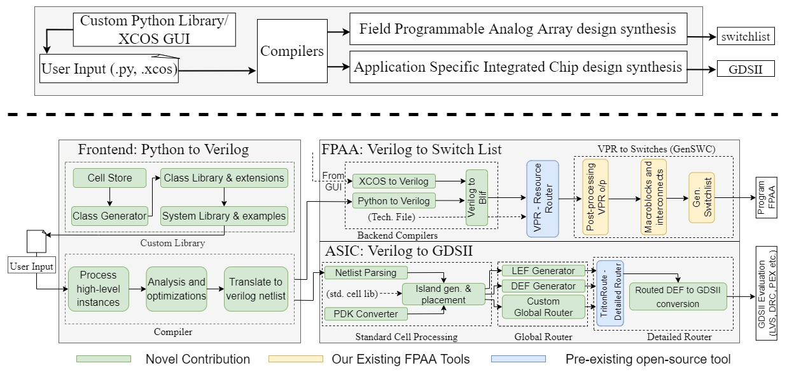

# Analog Synthesis for High Level Systems (ASHES)



## Project Requirements
The project is designed to be cross-platform and run across Unix and Windows environments running `python 3.10` and above. 

### Python Dependencies

The python package can work as a standalone package whose outputs stop before the detailed router (TritonRoute) for the ASIC flow and before the resource allocator (VTR/VPR) for the FPAA flow. To install dependencies for just the python package run the following line.

```
pip install numpy verilog-parser
```

### Detailed Router
To view the final routed `.gds` file please download [TritonRoute](https://github.com/The-OpenROAD-Project/TritonRoute) and place it at the top level `./ashes/` directory. Once it is installed properly and the executable is available at `./ashes/TritonRoute/build/TritonRoute` simply run the example file

```
python example_usage.py
```

### Resource Allocator
Please refer to the [tool website](https://hasler.ece.gatech.edu/FPAAtool/index.html) for updates to a virtual machine with VPR/VTR pre-installed.

## Usage

1. Use examples to program a system to the FPAA or generate ASIC layout.

```python
import ashes_fg as af
from ashes_fg.examples import vec_alice, the_small_asic_v2

af.fpaa.compile(vec_alice, project_name='vec_alice')
af.asic.compile(the_small_asic_v2, project_name='asic_alice')
```

## Outputs
- FPAA Synthesis: `.blif` netlist, `.pads` file
- ASIC Synthesis 
    - Python package: global router files (.guide, .lef, .def) and `<project_name>_placed.gds`
    - Detailed router: `<project_name>_merged.gds`
- To view `.gds` output, download [klayout](https://www.klayout.de/) or use a viewer of your choice

 
