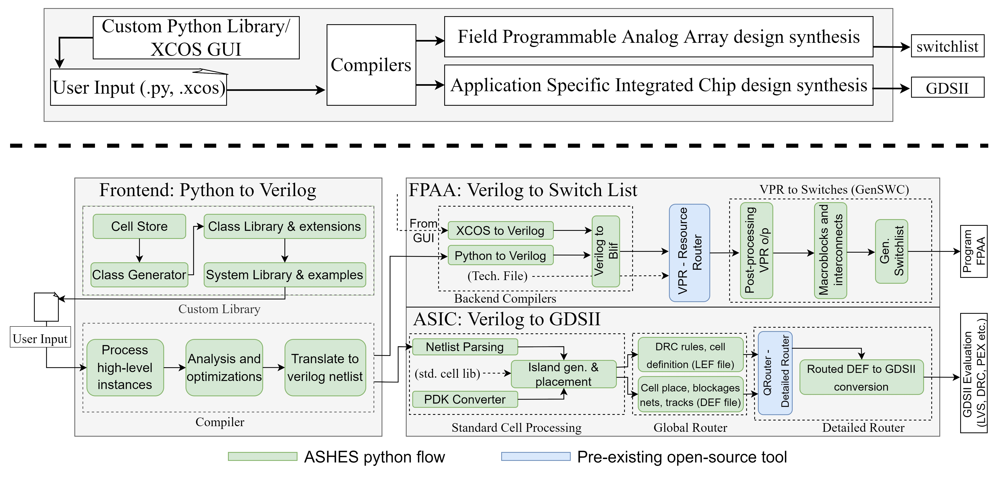

# Analog Synthesis for High Level Systems (ASHES)

ASHES is an (in-progress) tool that is capable of programming Field Programmable Analog Arrays (FPAAs) or generating tapout files (.gds) for analog computing applications using a programmable analog standard cell library. 

- Check out the initial paper on the tool. [Journal](https://www.mdpi.com/2079-9268/13/4/58)
- Learn more about FPAAs. [IEEE Link](https://ieeexplore.ieee.org/document/8915721), [PDF](https://hasler.ece.gatech.edu/FPAA_IEEEXPlore_2020.pdf)
- Learn more about the programmable analog standard cell flow across process nodes. [65nm](https://ieeexplore.ieee.org/document/10639182), [130nm](https://ieeexplore.ieee.org/document/10431551) 



## Project Requirements
- **Operating system:** The project has been tested in a linux environment on an Ubuntu 22 distro.  
- **Programming Tools:** Python3, TK/TCL, Scilab/XCOS and Bash.

### Dependencies

The tool can be installed as a standalone package whose outputs stop before the detailed router (Qrouter) for the ASIC flow and before the resource allocator (VTR/VPR) for the FPAA flow. To install dependencies for just the python package run the following line.

```
pip install numpy verilog-parser
```

However, to use the full capabilities of the tool please follow the instructions below.

### ASIC Flow: Detailed Router
For the detailed router we use the same tool from the [open circuit design flow by Tim Edwards](http://opencircuitdesign.com/qrouter/). The following instructions are copied verbatim from the [qrouter repository](https://github.com/RTimothyEdwards/qrouter). The tool has been tested using version 1.4.

Download qrouter [here](https://github.com/RTimothyEdwards/qrouter)

Double check you have all the dependencies installed
```
sudo apt-get install tcl8.5-dev
sudo apt install tk-dev
sudo apt-get install libxt-dev
```
Run the following commands
```
./configure
make
make install
```

### FPAA Flow: RASP30 Tool
The RASP30 tools are an earlier GUI based tool that evolved solely to program the 3.0 generation of FPAAs. Check out the [journal](https://link.springer.com/article/10.1007/s10617-021-09247-9) to learn more. As a result, ASHES incorporates a lot of that structure for its purely text-based flow. The repository comes with VPR but requires the installation of Scilab. 

- Download the rasp30 repository [here](https://github.com/jhasler/rasp30/tree/master)
- Download and install Scilab 5.5.2 [here](https://www.scilab.org/download/previous-versions)

Or reach out to the [lab PI](https://hasler.ece.gatech.edu/) for a copy of a VM with rasp30 and scilab pre-installed. 


## Usage

1. Use examples to program a circuit to the FPAA.

```python
import ashes_fg as af
from ashes_fg.examples import ors_buffer

af.fpaa.compile(ors_buffer, project_name='ors_buffer', chip_num=13)
```

Or define your own circuits using the class library.

```python
def ors_buffer():
    inpad1 = fg.inpad([5])
    buff_out = fg.ota_buf(inpad1)
    outpad = fg.outpada(buff_out, [6])
```

2. Use examples to generate an ASIC layout.

```python
import ashes_fg as af
from ashes_fg.examples import the_small_asic_v2

af.asic.compile(the_small_asic_v2, project_name='asic_alice')
```

Or similarly create custom designs from the standard cell library

```python
def small_classifier(vector_in):
    vmm = fg.vector_matrix_multiply(vector_in, dims=(1,6))
    wta = fg.wta_direct_vmm(vmm, vmm, vmm, vmm, num_instances=1)
    scan = fg.scanner(wta, wta, wta, wta, num_instances=1)
    return vmm, wta, scan

def the_small_asic_v2():
    afe = fg.fixed_size_afe(None)
    vector_in = [afe]
    vmm, wta, scan = small_classifier(vector_in)
    return vmm, afe, wta, scan
```

## Outputs
- FPAA Programming
    - Without the rasp30 repo, the tool can produce up to the `.blif` netlist. 
    - With the repo and an FPAA board, the tool can generate the final switchlist which it would subsequently program the connections on the device.
- ASIC Synthesis 
    - Without the detailed router, the tool can generate placement and write out that gds to `<project_name>_placed.gds`.
    - With the detailed router installed, it will create the final routed version `<project_name>_merged.gds`.
- To view `.gds` output, download [klayout](https://www.klayout.de/) or import into a viewer of your choice.

 
