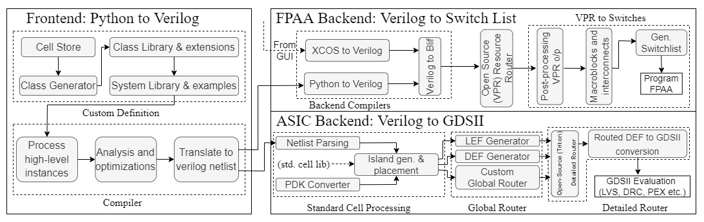

# Analog Synthesis for High Level Systems (ASHES)

ASHeS is a high level synthesis package from the ICE and SHARC labs at Georgia Tech! 



## Project Requirements
The project is designed to be cross-platform and run across Unix and Windows environments running `python 3.9` and above. 

```
pip install python-gdsii numpy verilog-parser
```

## Installation

## Usage

1. Use examples to program a system to the FPAA or generate ASIC layout.

```python
import ashes_fg as af
from ashes_fg.examples import vec_alice, the_small_asic_v2

af.fpaa.compile(vec_alice)
af.asic.compile(the_small_asic_v2, project_name='asic_alice')
```

## Outputs
- FPAA Synthesis: .blif netlist
- ASIC Synthesis: global router files (.guide, .lef, .def) and placed .gds
    - To view, download [klayout](https://www.klayout.de/)
